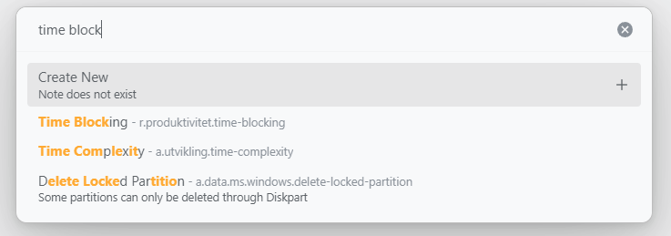
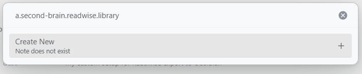
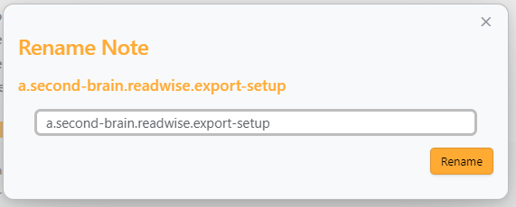
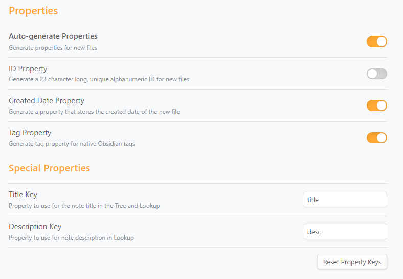

# Dendron Bridge

> Carrying forward Dendron's best traditions, with productivity first.

Dendron transforms note management from "finding files" to "thinking in paths" — using hierarchical naming like `project.tasks.todo`, making knowledge organization and retrieval effortless. Dendron Bridge brings this philosophy to Obsidian, so you can enjoy the Obsidian ecosystem without losing Dendron's core efficiency.

**Why "Bridge"?** Because it bridges the Dendron mindset with the Obsidian ecosystem.


## Core Philosophy

- **Hierarchical naming, path as structure** — Replace folders with dot-separated names; `project.tasks.todo` is both the filename and the knowledge structure
- **Lookup first, keyboard driven** — Fuzzy search to quickly locate or create notes, hands never leave the keyboard
- **Automatic properties, less repetitive work** — New notes auto-generate ID, title, creation time, and other frontmatter fields
- **Multi-vault isolation** — Each vault has independent configuration; vaults can be marked as "secret" to exclude from searches

## Features

- Browse notes using a hierarchical naming scheme with customizable separator
- Lookup with fuzzy search
- Automatic frontmatter generation for new files
- Multi-vault support
- Custom resolver and renderer for links and embeds
- Built-in renaming modal
- Exclude paths like `archive.*`
- Support for all file types (Canvas support is experimental)
- Preview tabs — single-click to preview, double-click or edit to promote to permanent tab

## Usage

### File Tree

Open the sidebar via the ribbon icon or the command "Open Dendron Bridge".

The hierarchy separator defaults to `.` and can be changed in settings.

A note with an orange circle indicates no corresponding file exists.


**Preview Tabs** — Single-click a note to open it in a preview tab (italic title, reusable). Only one preview tab exists at a time; clicking another note reuses the same tab. To promote the preview to a permanent tab:

- Double-click the note in the tree, or
- Start editing the file

If a file is already open in a permanent tab, single-clicking it in the tree switches to that tab instead of opening a duplicate.

Right-click (desktop) or long-press (mobile) a note to access:

- **Create Current Note** — create a file for a placeholder note
- **Create New Note** — open Lookup with the note's path prefilled
- **Delete Note** — delete the note file
- **Rename Note** — open the renaming modal

### Lookup



Run "Dendron Bridge: Lookup note" to open or create notes with fuzzy search. Input a non-existing path to see a "Create New" option.



### Renaming



Use "Dendron Bridge: Rename note" or right-click a note and select "Rename Note".

### Auto-generate Properties



Automatically generate ID, title, description, created date, and tags when creating new notes. Keys for title and description are customizable.

### Multi Vault

Add or remove vaults in plugin settings. Each vault can have its own property generation settings. Vaults can be marked as "secret" to exclude notes from lookup searches.

### Custom Resolver (Disabled by Default)

Overrides wikilink and embed rendering to use Dendron-style behavior.

### Excluded Paths

Demote certain paths (e.g., `archive.*`) in lookup results.

## Development

This project uses [pnpm](https://pnpm.io/) as the package manager. If you haven't installed it yet, you can do so with:

```bash
npm install -g pnpm
```

Common commands:

```bash
pnpm dev      # Watch mode — set OBSIDIAN_PLUGIN_DIR in .env for live reload
pnpm build    # Production build
pnpm test     # Run tests
pnpm format   # Format with Prettier
```

For live reload during development, create a `.env` file:

```
OBSIDIAN_PLUGIN_DIR=/path/to/your/vault/.obsidian/plugins/dendron-bridge
```

See `.env.example` for reference.

## Attribution

- [levirs565](https://github.com/levirs565/) — original [obsidian-dendron-tree](https://github.com/levirs565/obsidian-dendron-tree)
- [Rudtrack](https://github.com/Rudtrack) — continued development as [dendron-bridge](https://github.com/Rudtrack/dendron-bridge)
- [Dobrovolsky Bohdan](https://github.com/dobrovolsky) — inspiration from [Structured](https://github.com/dobrovolsky/obsidian-structure)
